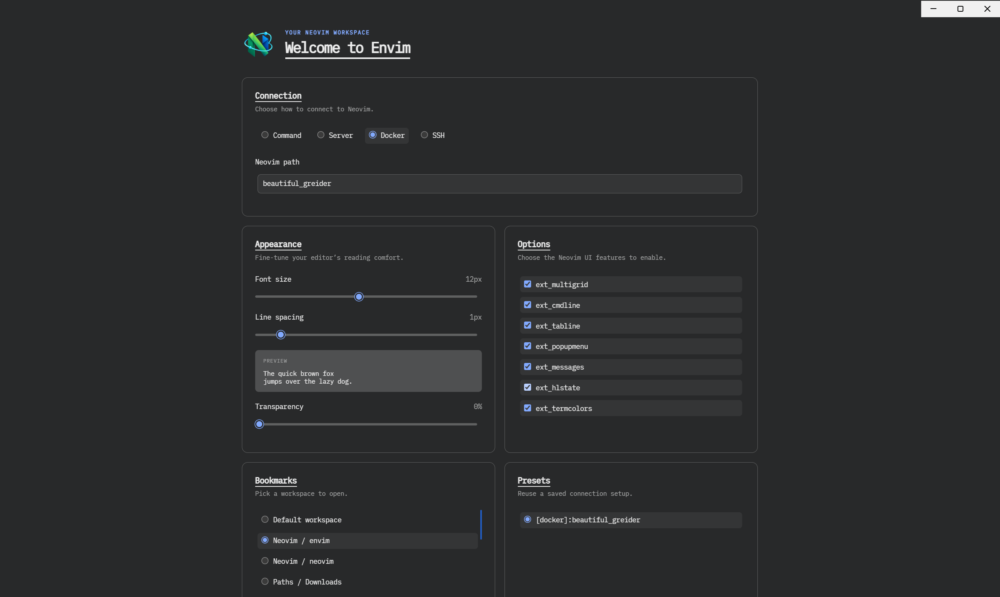
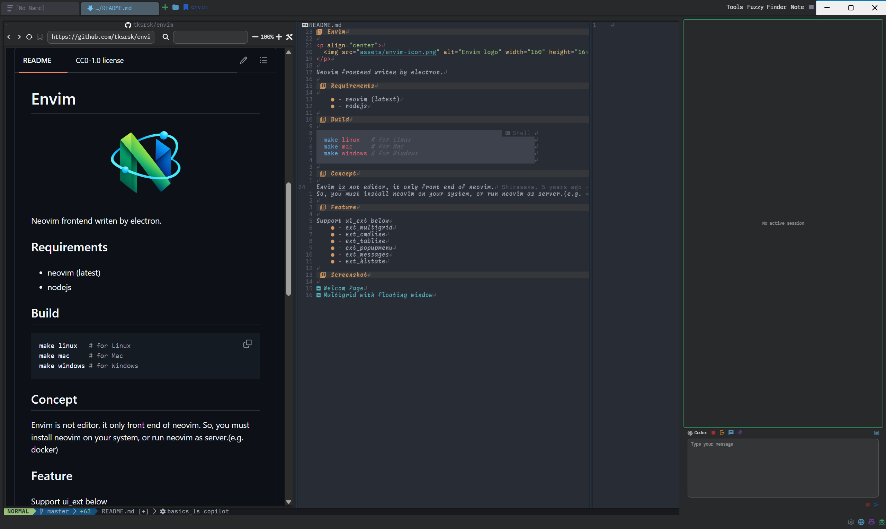

# Envim

<p align="center">
  
</p>

Neovim frontend writen by electron.

## Requirements

- neovim (latest)
- nodejs

## Build

```sh
make linux   # for Linux
make mac     # for Mac
make windows # for Windows
```

## Concept

Envim is not editor, it only front end of neovim.
So, you must install neovim on your system, or run neovim as server.(e.g. docker)

## Feature

Support ui_ext below
- ext_multigrid
- ext_cmdline
- ext_tabline
- ext_popupmenu
- ext_messages
- ext_hlstate

## Screenshot



